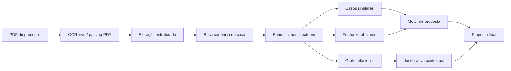

# Judicial Settlement MVP

MVP técnico para apoio à proposta de acordos em processos judiciais a partir de PDFs incompletos. A solução foi desenhada para demonstrar, de forma objetiva para uma equipe técnica, como combinar ingestão documental, enriquecimento externo, modelagem relacional em grafo, recuperação de casos similares e um motor de proposta explicável.

## Objetivo

O problema de negócio é transformar documentos processuais com baixa densidade informacional em uma base consolidada suficiente para:

- recuperar contexto externo do caso;
- montar histórico comparável;
- identificar sinais de conciliabilidade;
- estimar chance de aceite;
- sugerir proposta de acordo com justificativa auditável.

## Resumo executivo técnico

Este MVP foi concebido como um artefato de arquitetura e produto para avaliação técnica. A ideia central é demonstrar um pipeline capaz de:

- receber um PDF processual com baixa completude;
- estruturar uma representação canônica do caso;
- enriquecer esse caso com histórico e sinais externos;
- recuperar processos semelhantes;
- organizar contexto relacional em grafo;
- estimar conciliabilidade;
- produzir uma proposta inicial de acordo com justificativa explicável.

Em outras palavras, o projeto não tenta simular um mero dashboard. Ele demonstra uma `decision-support pipeline` para negociação jurídica assistida por dados.

## Leitura do projeto para uma equipe técnica

Este repositório foi estruturado como um `decision-support MVP` para uma plataforma de acordos judiciais digitais. A proposta é mostrar, de forma pragmática, como sair de um PDF processual com poucos dados para uma recomendação final de acordo baseada em:

- extração documental;
- enriquecimento externo;
- histórico comparável;
- modelagem relacional;
- score preditivo;
- explicação final rastreável.

## Escopo do MVP

O MVP recebe um PDF do processo, extrai campos estruturados, consulta uma camada de enriquecimento simulada inspirada em fontes como DataJud, monta uma visão em grafo das relações do caso, recupera processos semelhantes e sugere uma proposta de acordo.

## Decisões de arquitetura

### Por que começar por um MVP orientado a dados?

Porque o maior gargalo do problema não é apenas gerar texto com IA, e sim montar uma base confiável o suficiente para sustentar uma recomendação negocial. Por isso, a arquitetura foi pensada de trás para frente:

1. organizar uma camada canônica do caso;
2. enriquecer com histórico comparável;
3. produzir sinais de conciliabilidade;
4. só então gerar a proposta final.

### Por que usar uma base controlada nesta fase?

Nesta primeira versão, os dados são sintéticos e controlados por três razões:

- garantir reprodutibilidade;
- tornar explícita a lógica de modelagem;
- viabilizar avaliação técnica rápida sem dependência externa.

O desenho, porém, já está preparado para plugar conectores reais no lugar da base simulada.

## Arquitetura



## Fluxo funcional do MVP

1. O usuário envia um PDF do processo.
2. O sistema extrai campos estruturados mínimos do documento.
3. O caso é convertido em uma representação canônica.
4. Uma camada de enriquecimento busca sinais externos e comparáveis históricos.
5. Um grafo relacional organiza entidades e processos similares.
6. Um modelo baseline estima a chance de aceite.
7. Um motor de proposta converte o score e os comparáveis em oferta sugerida.
8. A interface exibe proposta, justificativa e evidências.

## Modelo conceitual de dados

O MVP trabalha com quatro entidades principais:

- `documento de entrada`
  PDF inicial recebido pelo usuário.
- `caso canônico`
  representação estruturada do processo após extração.
- `histórico comparável`
  base com casos análogos, outcomes e métricas de negociação.
- `camada de proposta`
  score, valores sugeridos e narrativa explicativa.

Campos centrais da entidade canônica:

- `process_number`
- `court`
- `court_division`
- `case_class`
- `subject`
- `plaintiff`
- `defendant`
- `phase`
- `claim_value`
- `document_date`
- `document_type`
- `requested_relief`

## O que a demonstração já faz

- gera PDFs jurídicos sintéticos para demonstração;
- extrai dados-chave do PDF via parsing;
- usa uma base histórica de apoio com acordos anteriores;
- recupera casos similares por `TF-IDF + cosine similarity`;
- cria um grafo com processo, partes, classe, assunto, tribunal e casos similares;
- treina um baseline de `Logistic Regression` para score de aceite;
- converte o score e os comparáveis em proposta sugerida;
- apresenta tudo em uma interface `Streamlit`.

## Técnicas usadas

### 1. Ingestão documental

Os PDFs demo são gerados com `reportlab` e lidos com `pypdf`. Nesta primeira versão o objetivo não é OCR pesado, e sim o desenho arquitetural da solução. Em uma fase seguinte, o parsing pode ser substituído por `PaddleOCR`, `PyMuPDF` e `pdfplumber`.

**Papel técnico desta camada**
- garantir uma entrada mínima reproduzível;
- simular o acoplamento com o intake documental do sistema;
- preparar o contrato de dados para uma futura etapa de OCR real.

### 2. Extração estruturada

A extração usa expressões regulares orientadas a campos processuais:

- número CNJ;
- tribunal;
- vara/unidade;
- classe processual;
- assunto;
- partes;
- fase;
- valor da causa;
- data;
- tipo documental;
- pedido principal.

**Por que regex nesta versão?**

Porque o foco do MVP é demonstrar o pipeline downstream. A extração por padrão estruturado torna o comportamento observável e deixa explícito o contrato da interface entre documento e base canônica.

### 3. Enriquecimento externo

O enriquecimento usa uma base histórica sintética, mas desenhada no formato de uma futura camada que pode receber integrações reais com:

- API pública do DataJud;
- diários oficiais;
- consulta processual complementar;
- APIs comerciais parceiras.

No MVP, cada sinal também registra a origem simulada, para já refletir um desenho auditável.

Os conectores futuros mais aderentes a uma solução de produção seriam:

- `DataJud` para metadados processuais e movimentações;
- diários oficiais para publicações e eventos relevantes;
- APIs processuais comerciais para cobertura ampliada;
- scraping direcionado por número CNJ, apenas como camada complementar e rastreável.

**O que esta camada agrega para o score**
- taxa histórica de acordo por réu;
- taxa histórica de acordo por assunto;
- taxa histórica de acordo por classe;
- proxies de tramitação e audiência;
- mediana do valor negociado em casos similares.

### 4. Recuperação de casos similares

Cada caso histórico é transformado em uma representação textual curta:

`classe + assunto + fase + réu`

Depois, o pipeline aplica:

- `TfidfVectorizer`
- `cosine_similarity`

Isso produz uma lista ranqueada de casos comparáveis, que servem tanto para o score quanto para a justificativa.

**Racional técnico**

Mesmo em um MVP controlado, a recuperação de similares é importante porque aproxima a proposta de um comportamento de `case-based reasoning`: a recomendação deixa de ser puramente estatística e passa a ser sustentada por precedentes comparáveis.

### 5. Grafo relacional

O grafo é montado com `networkx` e exibido com `Plotly`. Ele conecta:

- processo atual;
- autor;
- réu;
- classe;
- assunto;
- tribunal;
- casos similares.

O papel do grafo aqui é explicativo e contextual: ele mostra como o caso está conectado a padrões históricos e ajuda a defender a proposta sugerida.

**Por que grafo neste MVP**

O grafo não entra como motor principal de decisão, e sim como camada de contexto. Isso é intencional:

- evita complexidade desnecessária no baseline;
- preserva interpretabilidade;
- abre caminho para futuras features relacionais e graph analytics.

### 6. Modelo preditivo

O baseline de aceite usa `Logistic Regression` com:

- variáveis categóricas codificadas por `OneHotEncoder`;
- variáveis numéricas padronizadas com `StandardScaler`.

Features usadas:

- classe;
- assunto;
- fase;
- réu;
- valor da causa;
- proxy de movimentações;
- proxy de dias em aberto;
- proxy de audiência;
- tentativa prévia de acordo;
- taxa histórica de acordo do réu;
- taxa histórica de acordo do assunto;
- taxa histórica de acordo da classe;
- taxa de acordo entre casos similares;
- mediana da razão `acordo / valor da causa`.

Esta escolha foi deliberada para o MVP:

- é rápida de treinar e explicar;
- funciona bem como baseline tabular;
- deixa claro onde entram futuras evoluções com `LightGBM`, `CatBoost` e features de grafo.

### Formulação do problema

No desenho atual, o problema é tratado como uma classificação binária:

- `1`: casos com acordo aceito;
- `0`: casos sem aceite.

O target é simplificado para fins de demonstração, mas permite mostrar a mecânica do pipeline de modelagem:

- construção de features;
- treinamento supervisionado;
- inferência sobre um caso novo;
- tradução do score em ação negocial.

### 7. Motor de proposta

A proposta é construída a partir de:

- probabilidade estimada de aceite;
- mediana da razão de acordo dos casos similares;
- valor da causa;
- alternativa à vista e alternativa parcelada.

O MVP devolve:

- chance estimada de aceite;
- valor sugerido à vista;
- parcelamento sugerido;
- fatores mais relevantes;
- justificativa narrativa.

**Lógica atual**

A proposta combina:

- probabilidade estimada de aceite;
- mediana do histórico de acordos comparáveis;
- valor da causa;
- estratégia de fechamento à vista versus parcelado.

Isso representa uma primeira versão de um `settlement recommendation engine`.

## Tecnologias e bibliotecas

### Backend e dados
- `Python`: linguagem-base do pipeline.
- `pandas`: modelagem tabular, consolidação de features e artefatos intermediários.
- `pydantic`: schema forte para a entidade canônica extraída do documento.

### Documento e parsing
- `reportlab`: geração dos PDFs demo.
- `pypdf`: leitura do conteúdo textual do PDF.

### Similaridade e ML
- `scikit-learn`: `TfidfVectorizer`, `cosine_similarity`, `OneHotEncoder`, `StandardScaler`, `LogisticRegression`.

### Grafo e visualização
- `networkx`: construção do grafo relacional.
- `plotly`: renderização do grafo e apoio visual para interface.

### Interface
- `Streamlit`: front-end do MVP, pensado como camada de inspeção para usuário jurídico/técnico.

## Interface

O app em `Streamlit` está organizado em quatro abas:

1. `PDF e extração`
   Exibe os campos estruturados e o texto extraído.
2. `Enriquecimento`
   Mostra sinais externos e casos similares.
3. `Grafo`
   Exibe relações do caso com entidades e comparáveis.
4. `Proposta final`
   Apresenta score, valores sugeridos e justificativa.

### O que o Streamlit mostra tecnicamente

Além da demo funcional, a interface foi desenhada para servir como artefato de avaliação técnica:

- visão da arquitetura do pipeline;
- leitura da camada canônica do caso;
- lineagem das fontes de enriquecimento;
- tabela de features usadas no score;
- grafo relacional;
- racional da proposta e próximos passos de evolução.

## Resultado demonstrado pelo MVP

Na execução demo atual, o pipeline já entrega:

- processo identificado a partir do PDF;
- histórico de casos semelhantes ranqueados por similaridade;
- sinais externos consolidados por origem;
- grafo relacional com entidades e comparáveis;
- probabilidade estimada de aceite;
- proposta à vista e parcelada;
- justificativa técnica baseada em evidências.

Exemplo de saída do pipeline:

```text
process_number: 0839393-11.2025.8.19.0001
defendant: Energia Leste S.A.
similar_cases_found: 5
acceptance_probability: 0.9428
suggested_cash_value: 8607.84
installment_count: 6
suggested_installment_value: 1549.41
sources_used: 4
graph_nodes: 13
graph_edges: 17
```

## Leitura correta das métricas e do score

Os números do MVP não devem ser lidos como benchmark de produção. Eles existem para demonstrar coerência arquitetural e integração entre camadas.

O score atual:

- é treinado em uma base controlada;
- serve como baseline funcional;
- demonstra a passagem de `dados -> features -> probabilidade -> proposta`.

Em ambiente real, a evolução esperada seria:

- base histórica maior;
- avaliação temporal;
- calibração do score;
- métricas de classificação e ranking;
- explicabilidade formal com `SHAP`;
- medição de taxa real de aceite da proposta sugerida.

## Estrutura do repositório

```text
judicial-settlement-mvp/
├── app.py
├── main.py
├── requirements.txt
├── src/
│   ├── extraction.py
│   ├── enrichment.py
│   ├── graphing.py
│   ├── modeling.py
│   ├── pipeline.py
│   └── sample_data.py
├── tests/
│   └── test_pipeline.py
└── data/
    ├── raw/
    └── runtime/
```

## Artefatos gerados

Na execução do pipeline, o projeto materializa:

- `historical_cases.csv`
- PDFs demo de entrada
- `extracted_case.csv`
- `external_snapshot.csv`
- `similar_cases.csv`
- `summary.json`
- `case_graph.html`

Isso facilita inspeção, depuração e futura integração com API ou orquestrador.

## Como executar

```bash
python3 -m venv .venv
source .venv/bin/activate
pip install -r requirements.txt
python3 main.py
streamlit run app.py
```

## O que eu proporia para a próxima iteração

### OCR e intake real
- substituir parsing simples por OCR robusto;
- suportar PDF escaneado e imagem.

### Enriquecimento real
- conector DataJud;
- coleta orientada por número CNJ;
- lineagem por fonte e timestamp.

### Similaridade mais forte
- embeddings jurídicos;
- busca vetorial;
- filtros híbridos por tribunal, classe, assunto e fase.

### Modelo
- `LightGBM` / `CatBoost`;
- features de grafo;
- features de texto;
- calibration e monitoramento.

### IA generativa e agentes
- agente extrator;
- agente enriquecedor;
- agente recuperador de similares;
- agente redator da justificativa;
- agente revisor para auditoria da proposta.

## Leitura correta do MVP

Este projeto foi desenhado como um `technical proposal MVP`, não como produto final.

O que ele prova:

- a arquitetura é viável;
- o fluxo de enriquecimento faz sentido;
- a camada de grafo agrega explicabilidade;
- o score e a proposta podem ser construídos sobre uma base enriquecida.

Próximos passos naturais:

- trocar parsing simples por OCR real;
- conectar integrações reais com DataJud e diários;
- ampliar a base histórica;
- calibrar o modelo com dados reais de acordos;
- adicionar agentes para enriquecimento, revisão e justificativa;
- expor a solução também via API.

## Evolução técnica sugerida

### Fase 1
- OCR real com `PaddleOCR` ou `DocTR`;
- conectores externos reais;
- aumento de cobertura documental.

### Fase 2
- base histórica mais rica;
- embeddings para busca vetorial;
- features relacionais extraídas do grafo;
- `LightGBM` ou `CatBoost` para score de aceite.

### Fase 3
- agentes para revisão e explicação;
- proposta guiada por política negocial;
- trilha de auditoria e revisão humana;
- serving por API para integração com fluxo jurídico maior.
